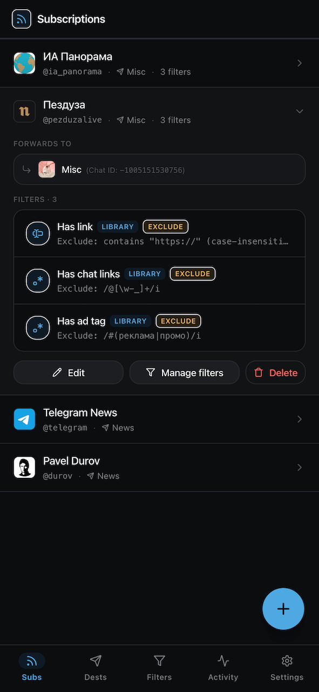
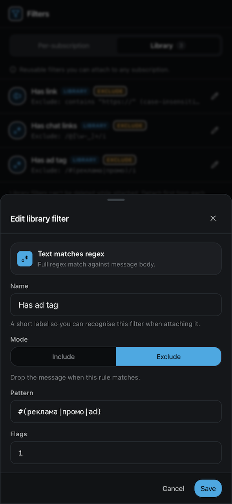

# tg-feed

Personal Telegram channel forwarding userbot with a mobile-friendly web UI for managing
subscriptions and filter rules.

[](LICENSE)
[](https://github.com/rzcoder/tg-feed/actions/workflows/ci.yml)


<p align="center">
  
  &nbsp;&nbsp;
  
</p>

Forward posts from any Telegram channel or chat your account can read — including ones you
don't admin — into a destination of your choice, with per-source filter rules. A
dedicated forwarding account (userbot) reads the source via MTProto; a small web UI lets
you manage subscriptions, attach filters, and watch activity live from your phone.

- **Server** — gramjs (MTProto) client + Fastify API + SSE, runs on a dedicated forwarding
  Telegram account separate from your main one.
- **Web** — Vite + React + Tailwind + shadcn/ui SPA for managing subscriptions, attaching
  parameterised filter rules, configuring throttle/delay, and watching live activity.
- **DB** — SQLite (better-sqlite3 + drizzle-orm).
- **Monorepo** — pnpm workspaces; shared types in `packages/shared`.

> [!WARNING]
> Automating a user account over MTProto is against Telegram's Terms of Service and can
> get the account limited or banned. Run this **only** on a dedicated throwaway forwarding
> account, never your main one. Use at your own risk.

## Features

- **Forward from any readable source** — public channels, private channels/groups you've
  joined, or `t.me/+invite` links (the userbot joins on add).
- **Filter rules** — `text-contains`, `text-excludes`, `text-regex` (RE2), `has-media`,
  `min-length`, `sender-allowlist`, each in **include** or **exclude** mode.
- **Reusable or private filters** — save a rule once in the **library** and attach it to
  many subscriptions, or add **inline** filters scoped to a single subscription.
- **Throttle & delay** — configurable per-message delay and album-debounce so bursts don't
  trip Telegram's flood limits; grouped media (albums) are forwarded as one.
- **Live activity feed** — server-sent events stream forward/skip/error activity to the UI
  in real time.
- **Reliable delivery** — a periodic history poller backstops the live update stream, which
  gramjs can silently stop delivering for high-volume channels.
- **Two ways to sign in** — a shared web password, or a Telegram Mini App login gated by an
  admin allowlist (see below).
- **Connect the account from CLI or the browser** — provide the forwarding session via
  `pnpm tg:login` + env, or sign in by phone number right on the Settings page (stored
  encrypted in the DB).

## Concepts

- **Subscription** — a _source_ channel/chat plus an optional _destination_ and a set of
  filters. A post forwards only if it passes the subscription's filters.
- **Destination** — the chat matched posts are forwarded into. A subscription with no
  destination is saved but stays inactive.
- **Filter** — a single rule (e.g. "text contains X") in include or exclude mode. Inline
  filters belong to one subscription; library filters are reusable across many.

## Requirements

- Node.js ≥ 20 (tested on 24.x)
- pnpm ≥ 10
- Docker (for production run)

## Quickstart — local dev

```bash
pnpm install
cp .env.example .env
# edit .env — at minimum: TG_API_ID, TG_API_HASH, WEB_PASSWORD, SESSION_SECRET

pnpm db:migrate               # apply DB migrations (idempotent)

# one-time: mint a session string for the forwarding account
pnpm tg:login                 # interactive: phone → code → 2FA → prints session string
                              # paste the printed string into .env as TG_SESSION_STRING

pnpm dev                      # boots server + web in parallel
```

> `pnpm tg:login` reads `TG_API_ID` / `TG_API_HASH` from `.env` if present and prompts
> for them otherwise. Run it on the **forwarding account** — not your main one.

## Connecting the forwarding account

The userbot needs a logged-in Telegram session. There are two ways to provide one:

1. **CLI + env (`pnpm tg:login`)** — the interactive script above (phone → code → 2FA)
   prints a session string you paste into `.env` as `TG_SESSION_STRING`. Best for headless
   setups; this is the path the quickstart uses.
2. **Settings page** — once the app is running, open **Settings → Telegram account** and
   sign in by phone number (code → 2FA) right in the browser. No CLI, no `.env` edit. The
   session is **encrypted at rest and stored in the database**.

The in-app sign-in requires `TG_SESSION_ENCRYPTION_KEY` (base64-encoded 32 random bytes)
to be set — it's the key the stored session is encrypted with. Generate one with:

```bash
node -e "console.log(require('node:crypto').randomBytes(32).toString('base64'))"
```

When a DB-stored account is present it takes precedence over `TG_SESSION_STRING`. Without
the encryption key the app stays env-only and won't persist an account from the UI.

## Quickstart — Docker

```bash
cp .env.example .env          # fill values
docker compose up -d --build
```

The image runs the server and serves the built web UI on a single port. Each GitHub
release also publishes a prebuilt multi-arch image to
`ghcr.io/rzcoder/tg-feed` — point `compose.yaml` at `ghcr.io/rzcoder/tg-feed:latest` to
run it without a local build.

## Configuration

Configuration comes from environment variables — see [.env.example](.env.example) for the
full annotated list (Telegram credentials, web auth, optional bot, port, DB path).

Some settings can also be managed from the web UI's **Settings** page, which stores them in
the database. **A value set there takes priority over the matching env var** and applies
without restarting:

- **Telegram account** (Settings → Telegram account) — sign in by phone instead of setting
  `TG_SESSION_STRING`.
- **Bot** (Settings → Bot) — bot token, admin allowlist (added by `@username` lookup), and
  public URL, instead of `TG_BOT_TOKEN` / `TG_BOT_ADMIN_IDS` / `PUBLIC_URL`.

Storing a secret from the UI (the forwarding session or the bot token) requires
`TG_SESSION_ENCRYPTION_KEY` to be set — it encrypts them at rest.

## Scripts

| Script                              | What it does                               |
| ----------------------------------- | ------------------------------------------ |
| `pnpm dev`                          | Run all workspaces in dev mode in parallel |
| `pnpm build`                        | Build all workspaces                       |
| `pnpm test`                         | Run Vitest across all workspaces           |
| `pnpm test:watch`                   | Vitest watch mode                          |
| `pnpm lint` / `pnpm lint:fix`       | ESLint                                     |
| `pnpm format` / `pnpm format:check` | Prettier                                   |
| `pnpm typecheck`                    | `tsc --noEmit` in every workspace          |

## Telegram Web App bot (optional)

You can open the web client directly inside a Telegram bot (as a [Mini
App](https://core.telegram.org/bots/webapps)) and sign in by your Telegram account
instead of typing the password. The password login stays available as a fallback.

Setup:

1. Create a bot with [@BotFather](https://t.me/BotFather) (`/newbot`) and copy its token.
2. Find your numeric Telegram user id (e.g. via [@userinfobot](https://t.me/userinfobot)).
3. Set in `.env`:

   ```bash
   TG_BOT_TOKEN=123456:your-bot-token
   TG_BOT_ADMIN_IDS=12345678          # comma-separated for multiple admins
   PUBLIC_URL=https://tg-feed.example.com   # public HTTPS URL of the web client
   ```

4. Restart the server. On boot the bot sets its menu button + `/start` button to open
   `PUBLIC_URL`. Tap it in Telegram and you're signed in automatically.

Or skip the `.env` edit and configure the bot from the web UI at **Settings → Bot**: add
admins by `@username` lookup, paste the bot token (stored encrypted — needs
`TG_SESSION_ENCRYPTION_KEY`), and set the public URL. Values saved there take priority over
the env vars and apply without a restart.

How it works: inside Telegram the client posts the signed `initData` to
`POST /api/auth/telegram`; the server verifies its HMAC against the bot token and checks
the user against `TG_BOT_ADMIN_IDS` before minting the same session a password login
would. Telegram requires **HTTPS** for Mini Apps — front the server with a TLS-terminating
reverse proxy (see `compose.yaml` notes). Leave `TG_BOT_TOKEN` / `TG_BOT_ADMIN_IDS` blank
to disable the bot entirely (password-only).

## Layout

```
apps/server     # Telegram client + Fastify API + SSE
apps/web        # React SPA
packages/shared # DTOs, zod schemas, cross-net types
Dockerfile      # production image (server + built web UI)
compose.yaml    # Docker Compose for production
```

To set up a dev environment and contribute, see [CONTRIBUTING.md](CONTRIBUTING.md).

## License

[MIT](LICENSE)
